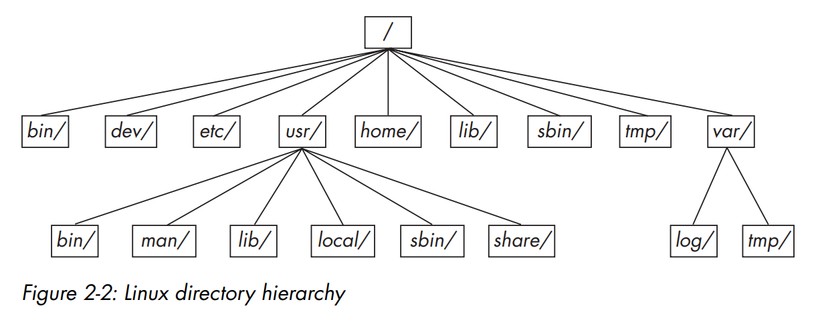

### The Bourne shell: /bin/sh

A shell is aprogram that runs commands, like the ones that users enter. The shell also serves as a small programming environment.

Linux uses an enhanced version of the Bourne shell called **bash**:  “**B**ourne-**A**gain” **sh**ell.

## Command-Line Editing

| Keybind | What it does |
| -- | :-- |
| **ctrl-B** | Move the cursor left |
| **ctrl-F** | Move the cursor right |
| **ctrl-P** | View the previous command (or move the cursor up) |
| **ctrl-N** | View the next command (or move the cursor down) |
| **ctrl-A** | Move the cursor to the beginning of the line |
| **ctrl-E** | Move the cursor to the end of the line |
| **ctrl-W** | Erase the preceding word |
| **ctrl-U** | Erase from cursor to beginning of line |
| **ctrl-K** | Erase from cursor to end of line |
| **ctrl-Y** | Paste erased text (for example, from ctrl-U) |

----

#### standart error redirecting
- `ls /fffffffff > f 2> e`
    The number 2 specifies the stream ID that the shell modifies. Stream ID 1 is standard output (the default), and 2 is standard error.


##### Standard Input Redirection
use < as in:  `head < /proc/cpuinfo`

## Listing and Manipulating Processes
Process is a running program. Each process on the system has a numeric process ID (PID).

### Listing
**ps x**   Show all of your running processes.
**ps ax** Show all processes on the system, not just the ones you own.
**ps u** Include more detailed information on processes.
**ps w** Show full command names, not just what fits on one line.


### Killing Processes

```bash
# killing
kill pid
# stop signal
kill -STOP pid
# continue signal
kill -CONT pid
# Temporary SToP signal
kill -TSTP pid
```


- Using ``ctrl-c`` to terminate a process that is running in the current terminal is the same as using kill to end the process with the INT (interrupt) signal.
### Job Control


You can send a TSTP signal with `ctrl-Z`, then start the process again by entering ``fg`` (bring to foreground) or ``bg`` (move to background).


But despite its utility and the habits of many experienced users, job control is not necessary and can be confusing for beginners: It’s common for users to press ``ctrl-Z`` instead of ``ctrl-C``, forget about what they were running, and eventually end up with **numerous suspended processes hanging around.**


### Background Processes
Normally, when you run a Unix command from the shell, you don’t get the shell prompt back until the program finishes executing. However, you can detach a process from the shell and put it in the “background” with the ampersand (&); this gives you the prompt back.

```bash
# this will run the gunzip command on the background
gunzip file.gz &
# to bring it to foreground use fg
fg
# to bring it to background use bg
bg
```


## File Modes And Permissions

```bash
ls -l
# outputs:
# -rw-r--r-- 1 juser somegroup 7041 Mar 26 19:34 endnotes.html
```

`-rw-r--r--` is called the file's mode. The file’s mode represents the file’s permissions and some extra information. There are four parts to the mode:

(`-`) Type. [`-` means regular file, `d` means directory]


(`rw-`) User Permissions


(`r--`) Group Permissions


(`r--`) Other (aka. world) Permissions, applied to everyone in the system


### Modifying Permissions

```bash
# give group the read permission
chmod g+r file
# give other (aka. system or world) read permission
chmod o+r file
# remove groups write permission 
chmod g-r file 
# change permissions via numbers
# 6 in binary is b110, so user permissions is read and write.
# 4 is b100, so group and system permissions is just read. 
chmod 644 file
```

### Symbolic Links
A symbolic link is a file that points to another file or a directory, effectively creating an alias (like a shortcut in Windows). Symbolic links offer quick access to obscure directory paths.

```bash
# Don’t forget the -s option when creating a symbolic link. 
# Without it, ln creates a hard link, giving an 
# additional real filename to a single file
ln -s target linkname
```

## archiving and compressing files

### gzip (compression)
Unlike the zip programs for other operating systems, gzip does not create archives of files.
```bash
# to zip file to file.gz 
gzip file
# to unzip file
gunzip file.gz
```

### tar (archive)
To create an archive, use tar instead:
```bash
# zipping with tar
# options: (c)reate (v)erbose (f)ile
tar cvf archive.tar file1 file2 file3

# table of contents
# options: (t)able (v)erbose (f)ile
tar tvf archive.tar

# unzipping with tar
# options: e(x)tract (v)erbose (f)ile
tar xvf archive.tar

# unzipping while preserving (p)ermissions
# options: preserve-(p)ermissions e(x)tract (v)erbose (f)ile
tar pxvf archive.tar
```

### Compressed Archives (.tar.gz)


```bash
# to decompress and extract run:
gunzip file.tar.gz
tar xvf file.tar
```

## Linux Directory Hierarchy Essentials



**/bin**  Contains executables including most of the basic Unix commands. Most of the programs in /bin are in binary format.


**/dev**  Contains device files.


**/etc**  This core system configuration directory (pronounced EHT-see) contains the user password, boot, device, networking, and other setup files. Many items in /etc are specific to the machine’s hardware.


**/home**  Holds personal directories for regular users.


**/lib**  This directory holds library files containing code that executables can use. There are two types of libraries: static and shared. The /lib directory __should contain only shared libraries__, but other lib directories, such as /usr/lib, contain both varieties as well as other auxiliary files.


**/proc**  Provides system statistics through a browsable directory-and-file interface. Much of the /proc subdirectory structure on Linux is unique, but many other Unix variants have similar features. The /proc directory contains information about currently running processes as well as some kernel parameters.


**/sys**  This directory is similar to /proc in that it provides a device and system interface.


**/sbin**  The place for system executables. Programs in /sbin directories relate to system management, so regular users usually do not have /sbin components in their command paths. Many of the utilities found here will not work if you’re not running them as root


**/tmp**  A storage area for smaller, temporary files that you don’t care much about. __Any user may read to and write from /tmp__, but the user may not have permission to access another user’s files there. __If something is extremely important, don’t put it in /tmp__ because most distributions clear /tmp when the machine boots and some even remove its old files periodically.


**/usr**  Although pronounced “user,” this subdirectory has no user files. Instead, __it contains a large directory hierarchy, including the bulk of the Linux system__. Many of the directory names in /usr are the same as those in the root directory (like /usr/bin and /usr/lib), and they hold the same type of files. 

(The reason that the root directory does not contain the complete system is primarily historic—in the past, it was to keep space requirements low for the root.)


**/var**  The variable subdirectory, where programs record runtime information. System logging, user tracking, caches, and other files that system programs create and manage are here. (You’ll notice a /var/tmp directory here, but the system doesn’t wipe it on boot.)


**/**