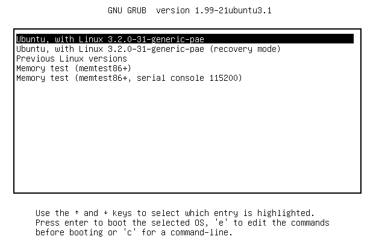
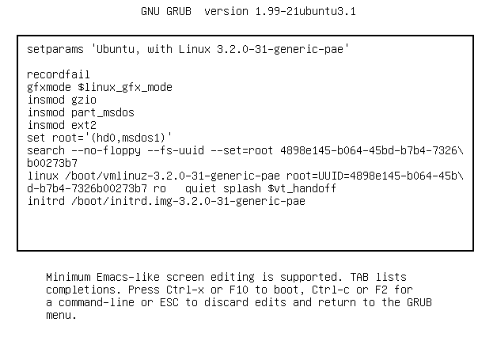

# How Linux Kernel Boots

## Overview

A simplified view of the boot process looks like this:

1. The machine’s BIOS or boot firmware loads and runs a boot loader.
2. The boot loader finds the kernel image on disk, loads it into memory, and starts it.
3. The kernel initializes the devices and its drivers.
4. The kernel mounts the root filesystem.
5. The kernel starts a program called init with a process ID of 1. This point is the user space start.94 Chapter 5
6. init sets the rest of the system processes in motion.
7. At some point, init starts a process allowing you to log in, usually at the end or near the end of the boot.

## **Startup Messages**

Traditional Unix systems produce many diagnostic messages upon boot that tell you about the boot process. The messages come first from the kernel and then from processes and initialization procedures that init starts. However, these messages aren’t pretty or consistent, and in some cases they aren’t even very informative. Most current Linux distributions do their best to hide them with splash screens, filler, and boot options.

There are **two ways** to view the kernel’s boot and runtime diagnostic
messages. You can:

* Look at the kernel system log file. You’ll often find this in **/var/log/kern.log**, but depending on how your system is configured, it might also be lumped together with a lot of other system logs in /var/log/messages or elsewhere.
* Use the `dmesg` command. The dmesg command uses the kernel ring buffer, which is of limited size, but most newer kernels have a large enough buffer to hold boot messages for a long time.

## **Kernel Initialization and Boot Options**
Upon startup, the Linux kernel initializes in this general order:
1. CPU inspection
2. Memory inspection
3. Device bus discovery
4. Device discovery
5. Auxiliary kernel subsystem setup (networking, and so on)
6. Root filesystem mount
7. User space start

The first steps aren’t too remarkable, but when the **kernel gets to devices**, a question of dependencies arises. For example, the disk device drivers may depend on bus support and SCSI subsystem support.


Later in the initialization process, **the kernel must mount a root filesystem before starting init**.

## **Kernel Parameters**

When running the Linux kernel, the boot loader passes in a set of text-based kernel parameters that tell the kernel how it should start. The parameters specify many different types of behavior, such as the amount of diagnostic output the kernel should produce and device driver–specific options.

You can view the kernel parameters from your system’s boot by looking
at the `/proc/cmdline` file:

```bash
$ cat /proc/cmdline

BOOT_IMAGE=/boot/vmlinuz-3.2.0-67-generic-pae root=UUID=70ccd6e7-6ae6-44f6-812c-51aab8036d29 ro quiet splash vt.handoff=7
```
Some Kernel Parameters:
- `ro` - Read-Only Mode: it instructs the kernel to mount the root filesystem in read-only mode upon user space start. (**Read-only mode ensures that fsck can check the root filesystem safely**; after the check, the
bootup process remounts the root filesystem in read-write mode.)
- `splash` - for displaying a splash screen
- `root` - location of the root filesystem. without it, the kernel cannot find init and therefore cannot perform the user space start.


Upon encountering a parameter that kernel does not understand, the Linux kernel saves the parameter. The kernel later passes the parameter to `init` when performing the user space start. For example, if you add -s to the kernel parameters, the kernel passes the -s to the init program to indicate that it should start in single-user mode.

## **Boot Loaders**
At the start of the boot process, before the kernel and init start, a boot loader starts the kernel. The task of a boot loader sounds simple: It loads the kernel into memory, and then starts the kernel with a set of kernel parameters. But consider the questions that the boot loader must answer:

- Where is the kernel?
- What kernel parameters should be passed to the kernel when it starts?

The answers are (typically) that the kernel and its parameters are usually somewhere on the root filesystem.


Boot Loaders use the **Basic Input/Output System (BIOS)** or **Unified Extensible Firmware Interface (UEFI)** to access disks. Nearly all disk hardware has firmware that allows the BIOS to access attached storage hardware with **Linear Block Addressing (LBA)**.


The filesystem question is trickier. Most modern boot loaders can read partition tables and have built-in support for read-only access to filesystems. Thus, they can find and read files. This capability makes it far easier to dynamically configure and enhance the boot loader. 

## **Boot Loader Tasks**

A Linux boot loader’s core functionality includes the ability to do the following:
- Select among multiple kernels.
- Switch between sets of kernel parameters.
- Allow the user to manually override and edit kernel image names and
parameters (for example, to enter single-user mode).
- Provide support for booting other operating systems.


Boot Loaders have become considerably more advanced since the inception of the Linux kernel, with features such as history and menu systems,
but the basic need has always been flexibility in kernel image and parameter selection.

## **GRUB: Grand Unified Boot Loader**

GRUB stands for Grand Unified Boot Loader.

One of GRUB’s most important capabilities is **filesystem navigation that allows for much easier kernel image and configuration selection**. One of the best ways to see this in action and to learn about GRUB in general is to look at its menu. The interface is easy to navigate, but there’s a good chance that you’ve never seen it. Linux distributions often do their best to hide the boot loader from you. 

- To access the GRUB menu, press and hold shift when your BIOS or firmware startup screen first appears.

### **GRUB MENU**



### **GRUB Configuration Editor**



This screen tells us that for this configuration, the **root is set with a UUID**, the **kernel image is /boot/vmlinuz-3.2.0-31-generic-pae**, and the kernel parameters include ro, quiet, and splash. The **initial RAM filesystem is /boot/initrd.img-3.2.0-31-generic-pae**. 


Why are there multiple references to `root`, and why are they different? Why is `insmod` here? Isn’t that a Linux kernel feature normally run by `udevd`? The double-takes are warranted, because GRUB doesn’t really use the Linux kernel — it starts it. **The configuration you see consists wholly of GRUB internal commands. GRUB really is an entirely separate world.**


The confusion stems from the fact that GRUB borrows terminology
from many sources. GRUB has its own “kernel” and its own insmod command to dynamically load GRUB modules, completely independent of the Linux kernel. Many GRUB commands are similar to Unix shell commands; there’s even an ls command to list files.


But the most confusion comes from the use of the word root. To clear it up, there is one simple rule to follow when you’re looking for your system’s root filesystem: **Only the root kernel parameter will be the root filesystem when you boot your system.**


## **UEFI Secure Boot Problems**

One of the newest problems affecting Linux installations is the secure boot feature found on recent PCs. When active, this mechanism in UEFI **requires boot loaders to be digitally signed by a trusted authority in order to run**. Microsoft has required vendors shipping Windows 8 to use secure boot. The result is that if you try to install an unsigned boot loader (which is most current Linux distributions), it will not load. 


The easiest way around this for anyone with no interest in Windows is to disable secure boot in the EFI settings. However, this won’t work cleanly for dual-boot systems and may not be an option for all users. Therefore, Linux distributions are offering signed boot loaders. Some solutions are just frontends to GRUB, some offer a fully signed loading sequence (from the boot loader to the kernel), and others are entirely new boot loaders (some based on efilinux).


## How GRUB Works

Let’s wrap up our discussion of GRUB by looking at how it does its work:
1. The PC BIOS or firmware initializes the hardware and searches its boot-order storage devices for boot code.
2. Upon finding the boot code, the BIOS/firmware loads and executes it. **This is where GRUB begins.**
3. The GRUB core loads.
4. The core initializes. At this point, GRUB can now access disks and filesystems.How the Linux Kernel Boots 109
5. GRUB identifies its boot partition and loads a configuration there.
6. GRUB gives the user a chance to change the configuration.
7. After a timeout or user action, GRUB executes the configuration (the sequence of commands outlined in Section 5.5.2).
8. In the course of executing the configuration, GRUB may load additional code (modules) in the boot partition.
9. GRUB executes a boot command to load and execute the kernel as specified by the configuration’s linux command.